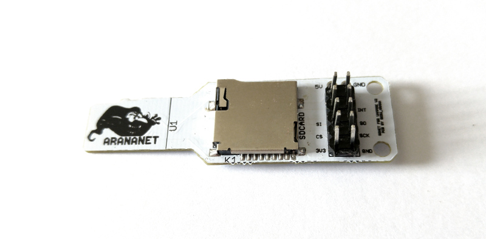
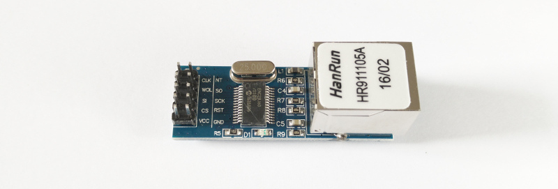
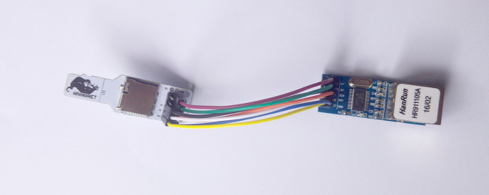
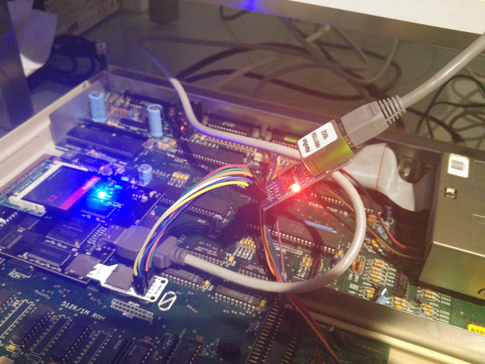

# Assembling an SDNet device for Amiga with a Vampire accelerator

## Introduction

The Vampire 500 V2+ accelerator card doesn't provide network ports, but you can build an SDNet device, which connects to the micro sd and solves that handicap.

This text is not exactly a tutorial. It's more like a report of how I assembled my SDNet device. So, the steps I describe here should work with the hardware and software I used but if you use other stuff, this might not work exactly as described.

This document (and images) is under a Creative Commons [CC BY-SA 4.0](https://creativecommons.org/licenses/by-sa/4.0/) license. That means you can share and adapt it anyway you want as long as you give the appropriate credits to the author and distribute your contributions under the same license.

## Requirements
- Amiga 500
- Vampire 500 V2+ accelerator card (with Gold 2.5 or better)
- 32GB CF Card with ApolloOS installed (version R43+)
- [Arananet SDNet adapter](https://arananet.net/pedidos/)
- ENC28J60 Ethernet LAN Module **3.3V** (don't use the most common 5V ones)
- Female [DuPont or jump wires](https://en.wikipedia.org/wiki/Jump_wire)

ApolloOS includes all software you should need: sdnet driver and Roadshow TCP/IP stack.

The version of Roadshow that comes with ApolloOS is a demo version. It works for a few minutes and then shuts down. You can [buy the full version](http://roadshow.apc-tcp.de/index-en.php) if you want.

This is the Arananet SDNet adapter I used:

And this is the ENC28J60 Module I used:

## Step 1

Connect the jump wires between the SDNet adapter and the ENC28J60 module. 

Although the Arananet SDNet adapter comes with the pinout printed on it, I couldn't get it to work that way. I emailed the manufacturer and he told me there are two possible pinouts, depending on the ENC28J60 module you're using. So, if one doesn't work for you, try the other one.

Here are the 2 possible pinouts on the SDNet adapter (seen from above):

### pinout 1

        5V   oo GND
    
             oo
             oo INT
        SI   oo SO
        CS   oo SCK
       3,3V  oo GND

### pinout 2

        5V   oo GND
    
             oo INT
             oo SO
        SI   oo SCK
        CS   oo 
       3,3V  oo GND

The end result should be something like this:

## Step 2

After connecting all the wires, plug the sdnet adapter into the micro sd slot of your Vampire and plug an ethernet cable into the ENC28J60 module:

## Step 3

Edit `S:startup-sequence` file and comment these lines that should be near the end (put the semicolon at the beginning of each line):

        ;If EXISTS S:Network-Startup
        ;  Execute S:Network-Startup
        ;EndIf

## Step 4

Go to `System:Storage/NetInterfaces` drawer and copy the following files into `DEVS:NetInterfaces` drawer:

- `SDNet`
- `SDNet.info`

## Step 5

Make sure you have the `sdnet.device` file in drawer `DEVS:Networks`.

## Step 6

Reboot your Amiga

## Step 7  (OPTIONAL - testing the sdnet)
- download sdnet0.8.lha from aminet and copy it into your CF card (use WinUAE to do that)
- extract contents of that file (suggestion: use Dopus)
- open a CLI window and execute the `sdnettest` binary

## Step 8 (enable network by starting Roadshow):

Open a CLI window and execute the following command:

        addnetinterface sdnet

or simply double click on the SDNet icon inside `DEVS:NetInterfaces` drawer.

## Step 9 (shutdown Roadshow/disable network):

        netshutdown

**Author:** Tiago Epifânio

**License (all text and documents):** [CC BY-SA 4.0](https://creativecommons.org/licenses/by-sa/4.0/)

