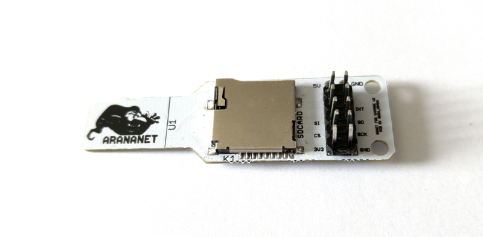
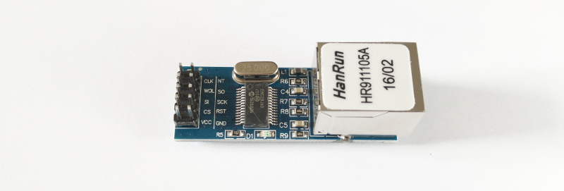
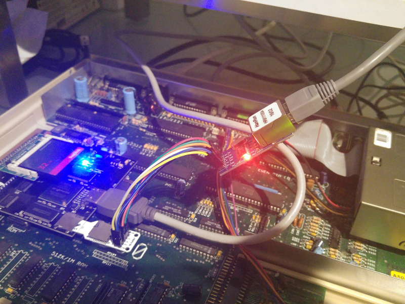

# Montar um dispositivo SDNet para um Amiga com uma aceleradora Vampire

## Introdução

A placa aceleradora Vampire 500 V2+ não vem equipada com portas de rede, mas podemos montar um dispositivo SDNet, o qual se liga ao leitor de cartões micro SD, e ultrapassa essa lacuna.

Este texto não é exactamente um tutorial. Podemos considerar que é mais um relato de como eu montei o meu dispositivo SDNet. Por isso, deve-se ter em conta que os passos aqui descritos deverão funcionar, caso se utilize exactamente o mesmo hardware e software que eu usei. Se for usada outra combinação, deverão ser feitas as adaptações necessárias, as quais não se encontram aqui descritas. É importante a leitura do ficheiro README que se encontra no interior do arquivo sdnet0.8.lha (fazer download na [aminet](http://aminet.net/)).

Este documento (e respectivas imagens) encontram-se sob uma licença Creative Commons [CC BY-SA 4.0](https://creativecommons.org/licenses/by-sa/4.0/). Isto significa que qualquer pessoa pode partilhar e adaptar como entender, desde que sejam atribuídos os créditos ao autor e que o trabalho resultante seja distribuído sob a mesma licença.

## Requisitos
- Amiga 500
- Aceleradora Vampire 500 V2+ (com Gold 2.5 ou superior)
- Cartão CF 32GB com o ApolloOS instalado (versão R43 ou superior)
- [Adaptador SDNet Arananet SDNet](https://arananet.net/pedidos/)
- Módulo de Ethernet ENC28J60 **3.3V** (não usar os mais comuns de 5V)
- [Cabos DuPont/jump](https://en.wikipedia.org/wiki/Jump_wire)

O sistema operativo ApolloOS inclui todo os software necessário: driver sdnet e stack TCP/IP Roadshow.

Atenção: a versão do Roadshow que vem com o ApolloOS é um versão de demonstração. Funciona durante alguns minutos e depois desliga-se. A versão completa pode ser comprada através [deste link](http://roadshow.apc-tcp.de/index-en.php).

Este é o adaptador SDNet (Arananet) que eu usei. Já inclui uma resistência na parte inferior e, por isso, não precisamos de acrescentar uma (óptimo para que não tem skills de soldadura):

E este é o módulo ENC28J60 que usei:

## Passo 1

Ligar os cabos dupont entre o adaptador SDNet e o módulo ENC28J60.

Apesar do adaptador SDNet já trazer a identificação dos pins (pinout) impressos no próprio adaptador, não consegui que funcionasse dessa forma. Enviei um email ao fabricante e este indicou-me que existem dois pinouts possíveis, dependendo do módulo ENC28J60 que se usar. Por isso, se um pinout não funcionar, experimentem o outro.

Aqui estão os dois pinouts possíveis para o adaptador SDNet (vista de cima):

### pinout 1

        5V   oo GND
    
             oo
             oo INT
        SI   oo SO
        CS   oo SCK
       3,3V  oo GND

### pinout 2

        5V   oo GND
    
             oo INT
             oo SO
        SI   oo SCK
        CS   oo 
       3,3V  oo GND

O resultado final será algo deste género:

## Passo 2

Depois de ligar todos os fios, é necessário introduzir o adaptador SDNet no leitor de cartões micro SD  da Vampire e, claro, ligar um cabo de rede ao módulo ENC28J60:

## Passo 3

Editar o ficheiro `S:startup-sequence` e comentar estas linhas que deverão estar perto do final do ficheiro (basta colocar um ponto-e-vírgula no início de cada linha):

        ;If EXISTS S:Network-Startup
        ;  Execute S:Network-Startup
        ;EndIf

## Passo 4

Ir à directoria `System:Storage/NetInterfaces` e copiar os seguintes ficheiros para a directoria `DEVS:NetInterfaces`:

- `SDNet`
- `SDNet.info`

## Passo 5

Garantir que o ficheiro `sdnet.device` se encontra na directoria `DEVS:Networks`.

## Passo 6

Reiniciar o Amiga.

## Passo 7 (OPCIONAL - testar o sdnet)
- fazer download do ficheiro sdnet0.8.lha a partir da aminet e copiá-lo para o cartão CF (utilizar o WinUAE para essa operação)
- já no Amiga, extrair o conteúdo desse ficheiro(sugestão: usar o Dopus)
- abrir uma janela CLI e executar o binário `sdnettest`

## Passo 8 (ligar a rede, executando o Roadshow):

Abrir uma janela CLI e executar o seguinte comando:

        addnetinterface sdnet

ou então fazer duplo clique no ícone SDNet que se encontra na directoria `DEVS:NetInterfaces`.

## Passo 9 (terminar o Roadshow/desligar a rede):

        netshutdown

**Autor:** Tiago Epifânio

**Licença (texto e imagens):** [CC BY-SA 4.0](https://creativecommons.org/licenses/by-sa/4.0/)
